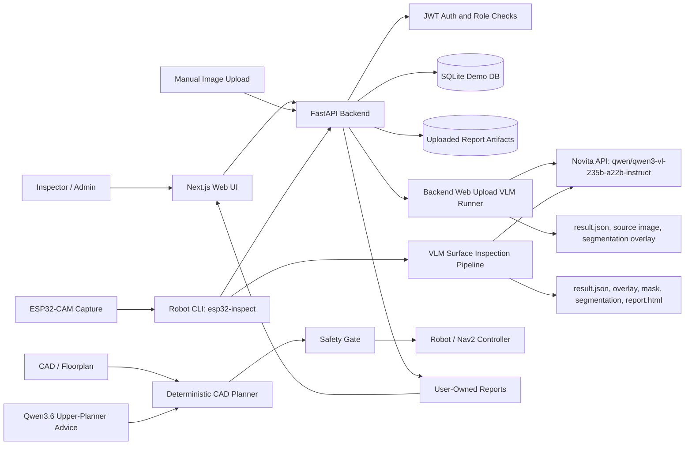

# Inspectra Architecture Diagram

This file documents the MVP component architecture and data flow.

## Component Diagram



## Main Data Flow

1. User logs in through the Next.js web UI.
2. The backend validates credentials and returns a JWT.
3. User uploads an image from the browser or robot CLI uploads completed VLM
   artifacts.
4. For direct web upload, the FastAPI backend calls Novita Qwen3-VL and creates
   report artifacts: source image, result JSON, and segmentation/overlay image.
5. For robot/ESP32-CAM flow, the robot CLI captures an image, runs the local VLM
   pipeline, then uploads result JSON, overlay, mask, segmentation overlay, HTML
   report, and capture metadata.
6. The backend writes report metadata to SQLite and stores large files under the
   upload artifact directory.
7. `created_by` associates every report with the authenticated user.
8. Normal users can only read their own reports. Admin users can inspect all
   reports.

## Robot Navigation Boundary

Camera images are not used to decide robot movement in this MVP.

Navigation rule:

```text
CAD/floorplan -> deterministic coverage/path planner -> safety gate -> robot controller
```

Qwen3.6-35B-A3B may suggest high-level scan order or planner parameters, but it
must not generate direct motor commands or executable waypoints.

## Components

| Component | Technology | Role |
|---|---|---|
| Web UI | Next.js | Login, dashboard, upload flow, report list, report detail |
| Backend API | FastAPI | Authentication, authorization, uploads, report APIs |
| Auth | JWT + roles | `admin`, `inspector`, `operator` |
| DB | SQLite demo DB | Users, report metadata, ownership, review state |
| Artifacts | File storage | Source images, overlays, masks, JSON, HTML report files |
| VLM provider | Novita | `qwen/qwen3-vl-235b-a22b-instruct` |
| Robot capture | ESP32-CAM + CLI | `surface_inspection_product/ros_robot_control` |
| Local VLM pipeline | Python | `surface_inspection_product/vlm_surface_inspection` |

## Report Artifact Types

Web upload flow:

- `source_image`
- `segmentation_overlay`
- `overlay`
- `result_json`

Robot/local VLM flow:

- `source_image`
- `overlay`
- `mask`
- `segmentation_overlay`
- `html_report`
- `capture_metadata`
- `result_json`
